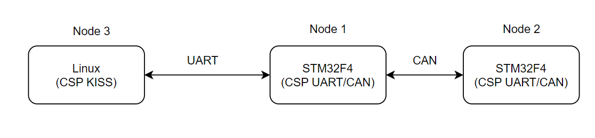

### I. Mô hình test CSP:

Sử dụng CSP 1.6 trên cả 3 node và truyền chuỗi từ Node 3 đến Node 2 thông qua 1 node trong gian như hình bên dưới:

- Sử dụng driver KISS qua UART để truyền và nhận dữ liệu giữa node 3 và node 1.

- Giữa node 1 và node 2 có thể truyền nhận thông qua CAN (hoặc UART).

